# 2021-12-23

## things to do 

- [x] make your bed
- [x] brush your teeth morning
- [x] meditate and visualization for 15mins

- [ ] study for 3 hrs with 48 mins break
- [ ] study for 3 hrs with 48 mins break
- [ ] study for 3 hrs with 48 mins break

- [ ] use Anki for more than one hours 
- [ ] use vim for at least 30 mins 

- [ ] brush your teeth in evening
- [ ] reflect
- [ ] Journalling
- [ ] make your table for another day to come 

## journal 

From Today I am using this planner and routine all the time...

## Quotes of the day  

## read today 

## watched today 

## photo log

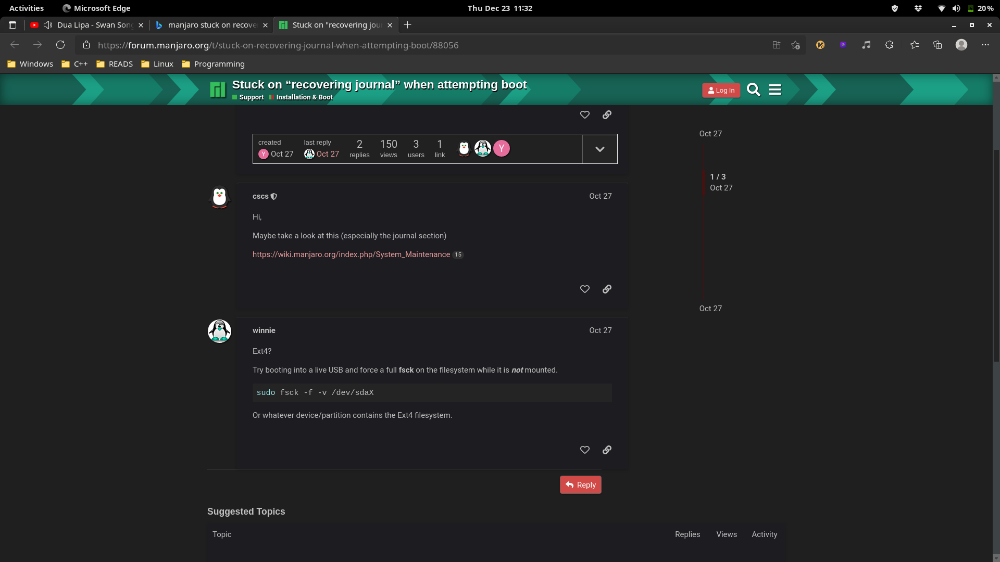
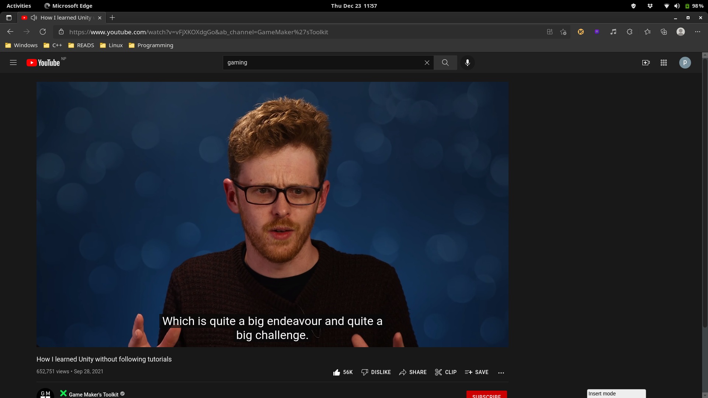

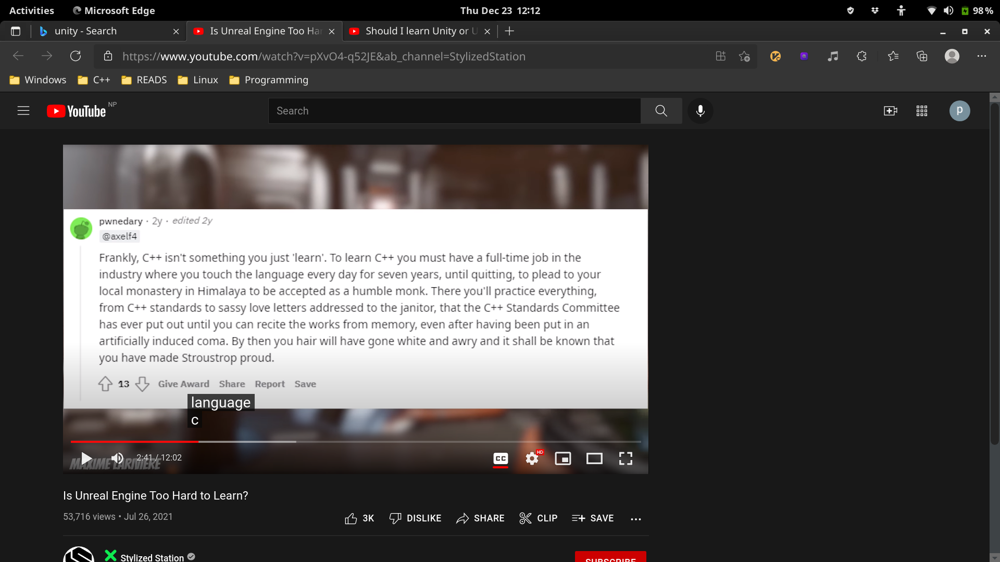
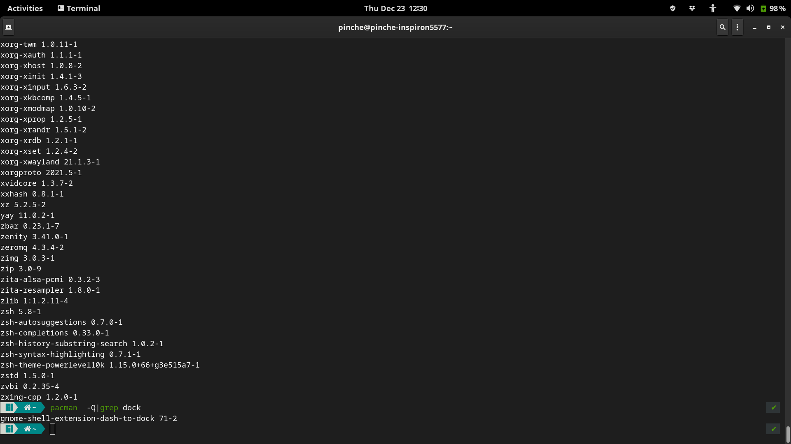
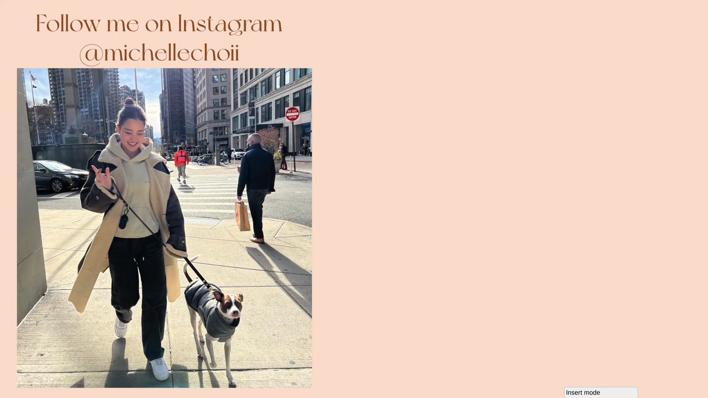
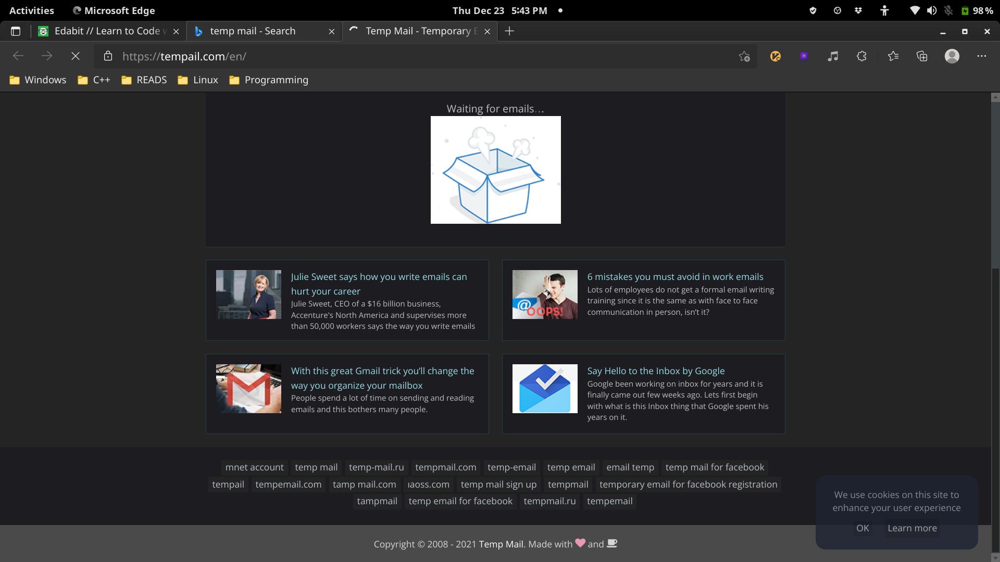
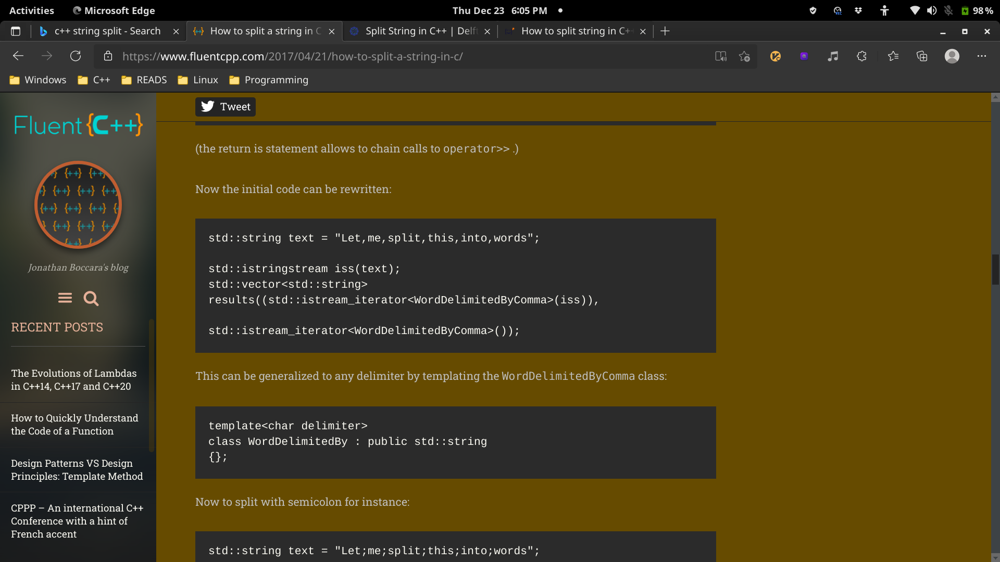
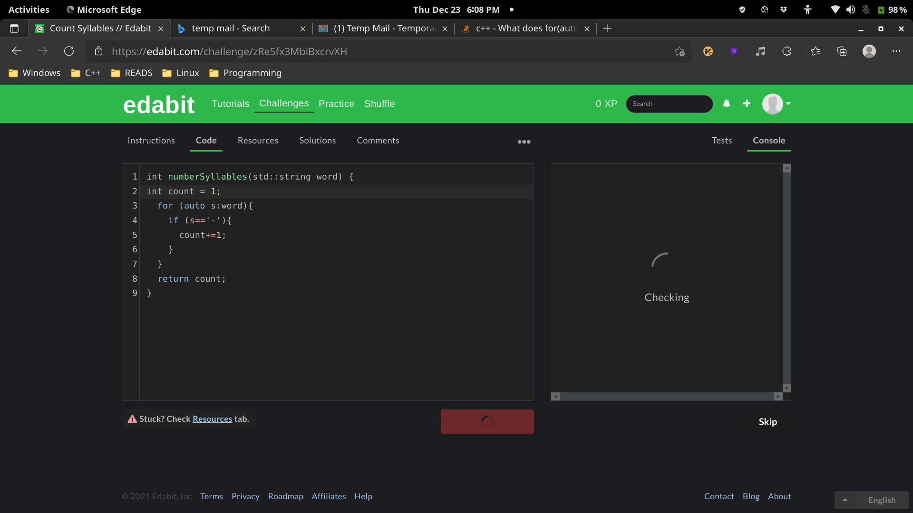
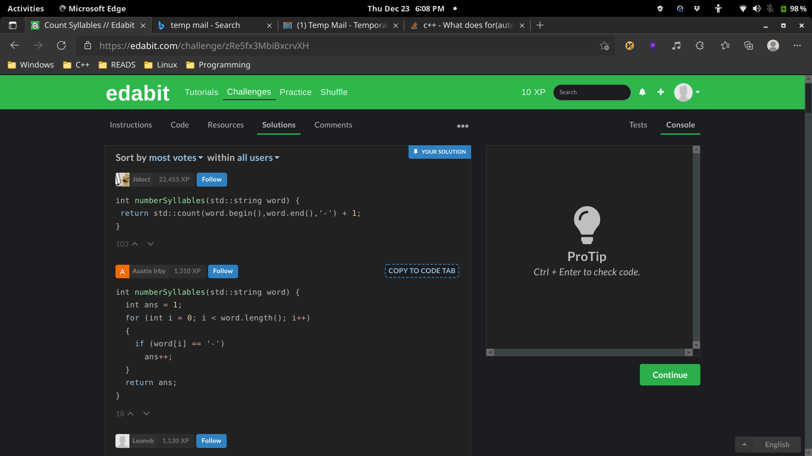
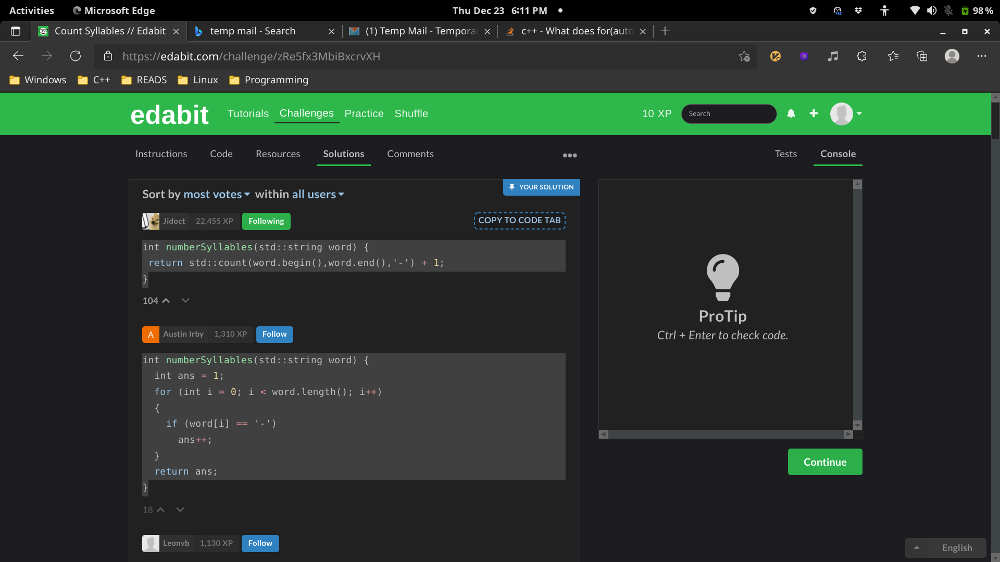
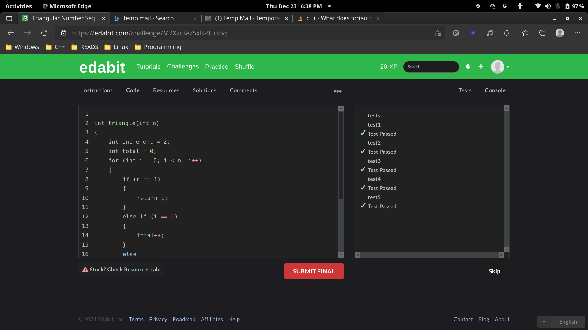
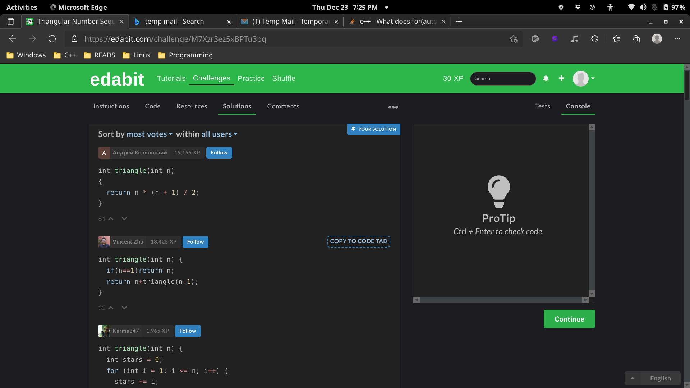
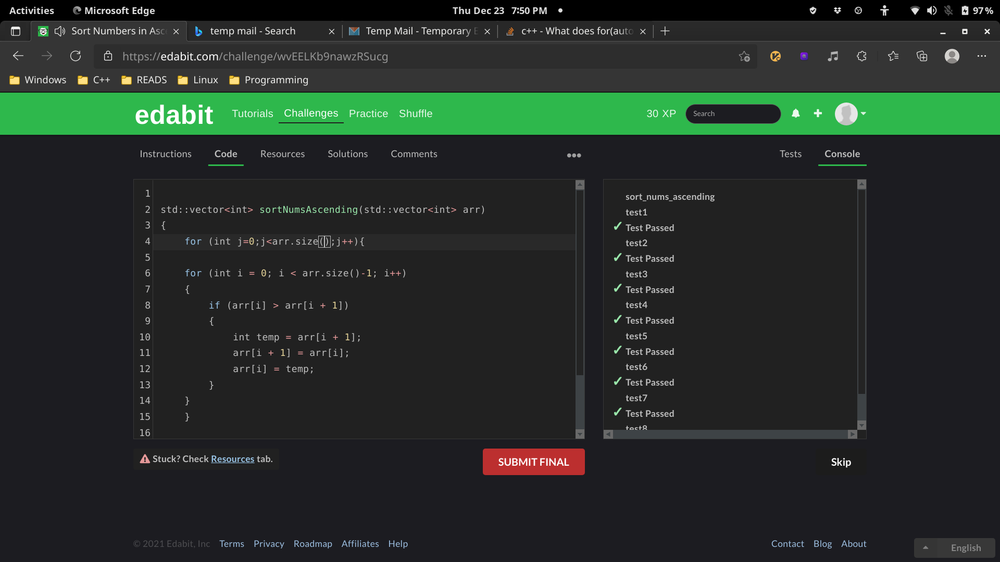

