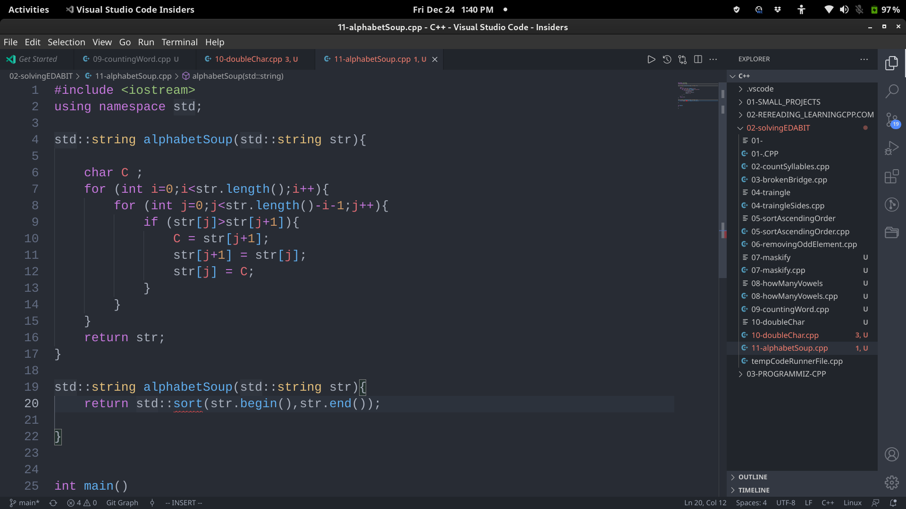

# 2021-12-24
#100DaysOfCode
## things to do 

- [x] make your bed
- [x] brush your teeth morning
- [x] meditate and visualization for 15mins

- [x] study for 3 hrs with 48 mins break
- [x] study for 3 hrs with 48 mins break
- [ ] study for 3 hrs with 48 mins break

- [ ] use Anki for more than one hours 
- [ ] use vim for at least 30 mins 

- [x] brush your teeth in evening
- [ ] reflect
- [x] Journalling
- [x] make your table for another day to come 

## journal 
I've been hitting the gym for a while now and it felt like I am loosing my weight...
today gym was closed due to water filling it up...

LIGHTS gone Its time for break;

Had a great day doing some problems on EDABIT.COM looking for days like this more and more #100DaysOfCode #day1 #day

## Quotes of the day  
#### TRAIN INSANE OR REMAIN THE SAME
## read today 

## watched today 

## photo log

