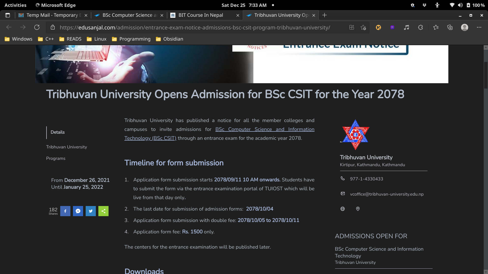
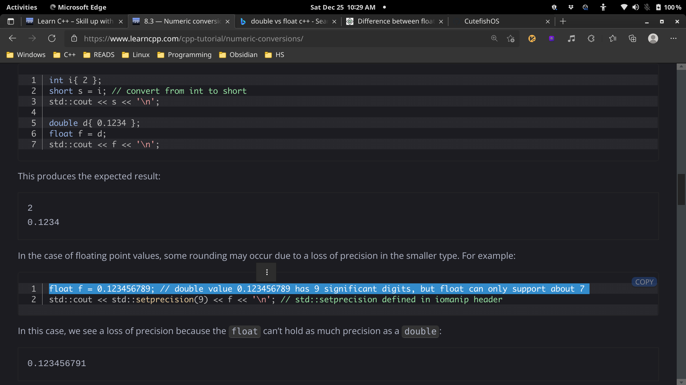

# 2021-12-25

## things to do 

- [x] make your bed
- [x] brush your teeth morning
- [x] meditate and visualization for 15mins

- [x] study for 3 hrs with 48 mins break
- [ ] study for 3 hrs with 48 mins break
- [ ] study for 3 hrs with 48 mins break

- [ ] use Anki for more than one hours 
- [ ] use vim for at least 30 mins 
- [x] LEARN VIM MORE

- [x] brush your teeth in evening
- [ ] reflect
- [x] Journalling
- [ ] make your table for another day to come 

## journal 
I exprienced heaviness and major difficulty in breathing in breathing which started from 9PM which lasted for next day to come

## Quotes of the day  

## read today 

## watched today 

## photo log

