# 2021-12-27

## things to do 

- [x] make your bed
- [ ] brush your teeth morning
- [ ] meditate and visualization for 15mins

- [ ] study for 3 hrs with 48 mins break
- [ ] study for 3 hrs with 48 mins break
- [ ] study for 3 hrs with 48 mins break

- [ ] SOLVE EDABIT 15 QUESTIONS

- [ ] use Anki for more than one hours 
- [ ] use vim for at least 30 mins 

- [x] brush your teeth in evening
- [ ] reflect
- [x] Journalling
- [ ] make your table for another day to come 

## journal 
Today is a  new day and I am feeling well and good about myself and I think and am willing to conquer the day...

## Quotes of the day  

## read today 

## watched today 

## photo log

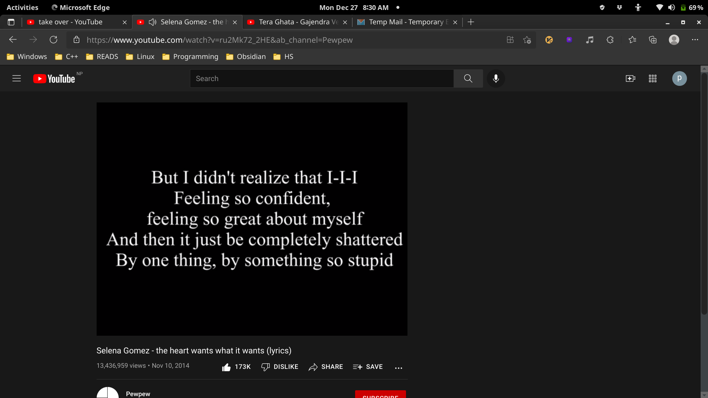
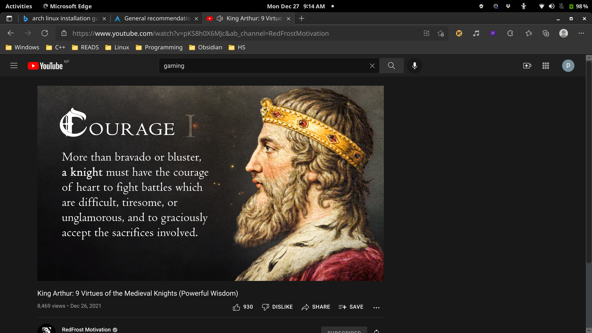
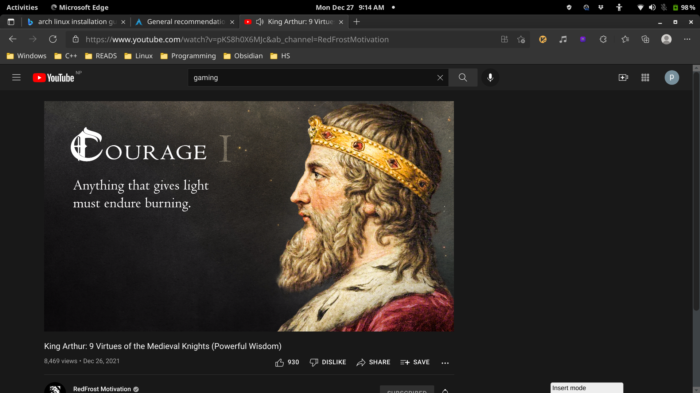
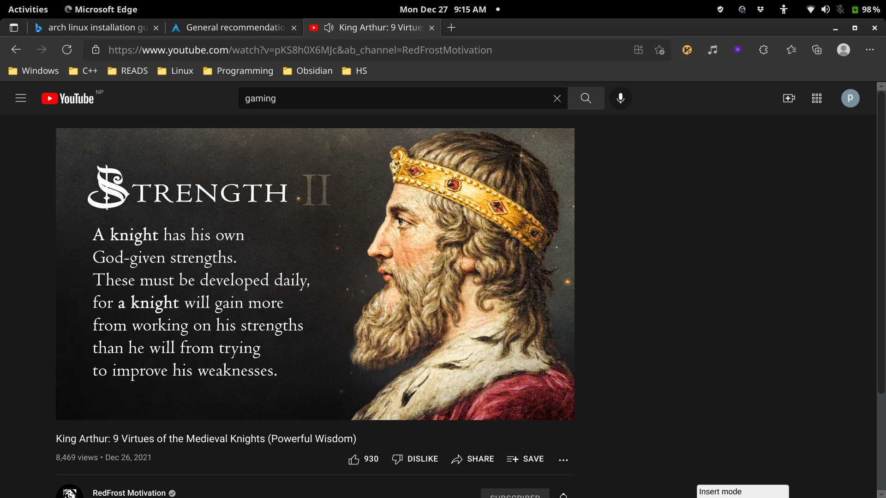
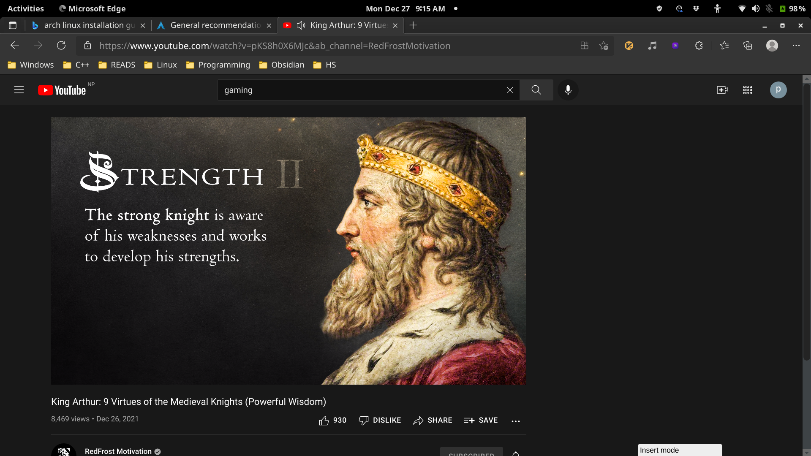
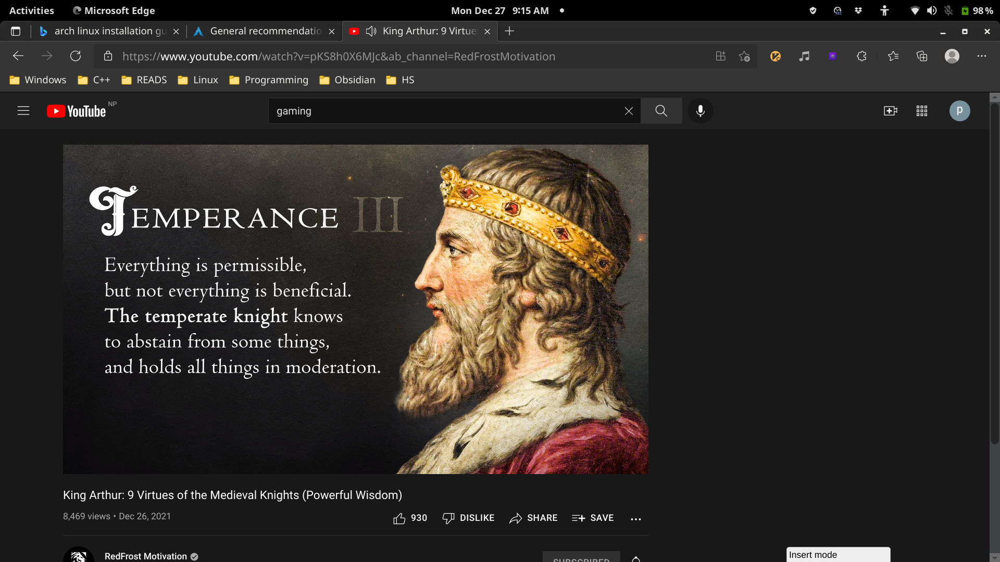

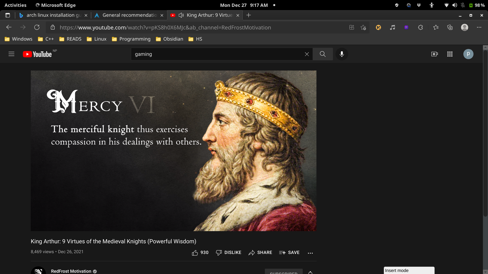
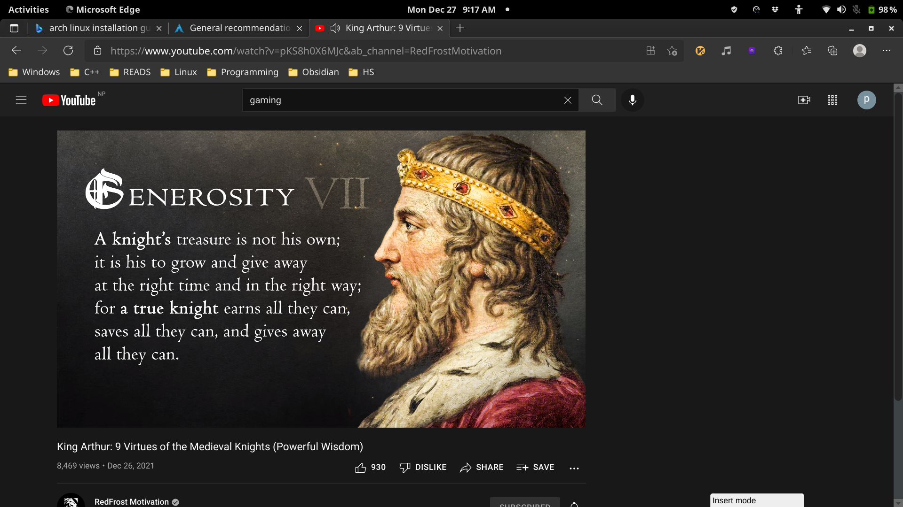
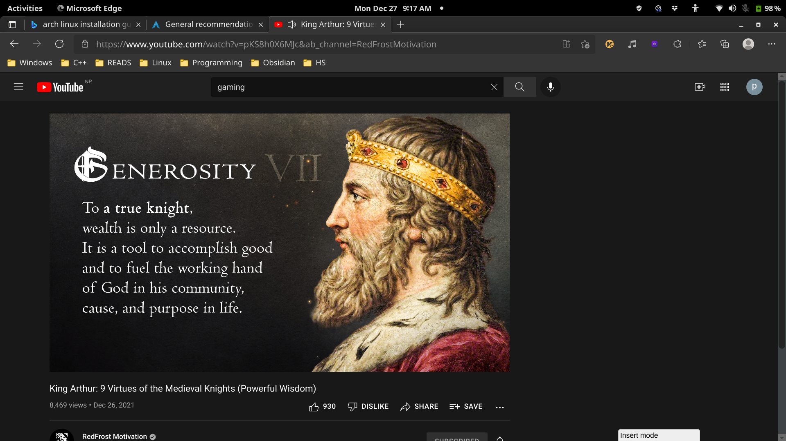

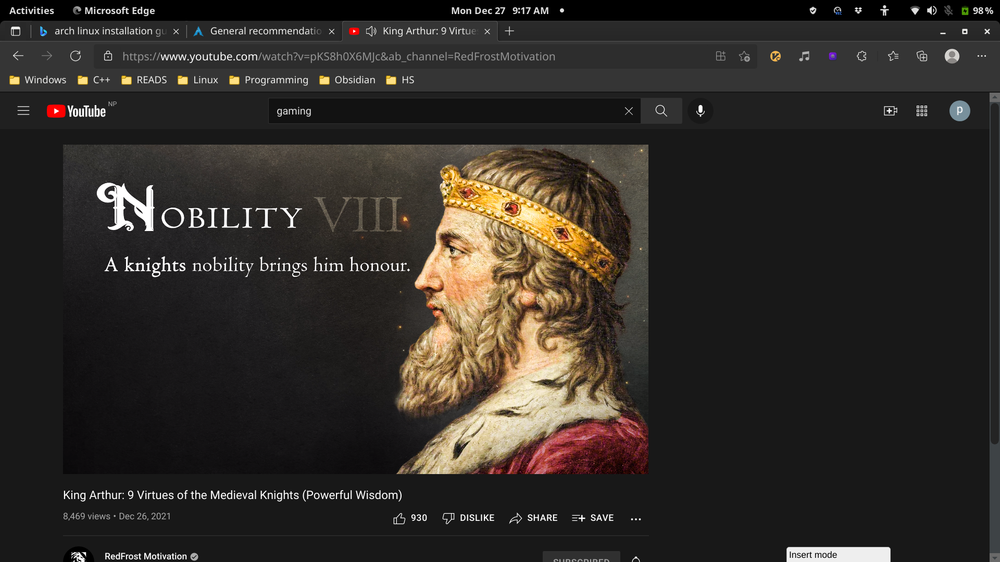
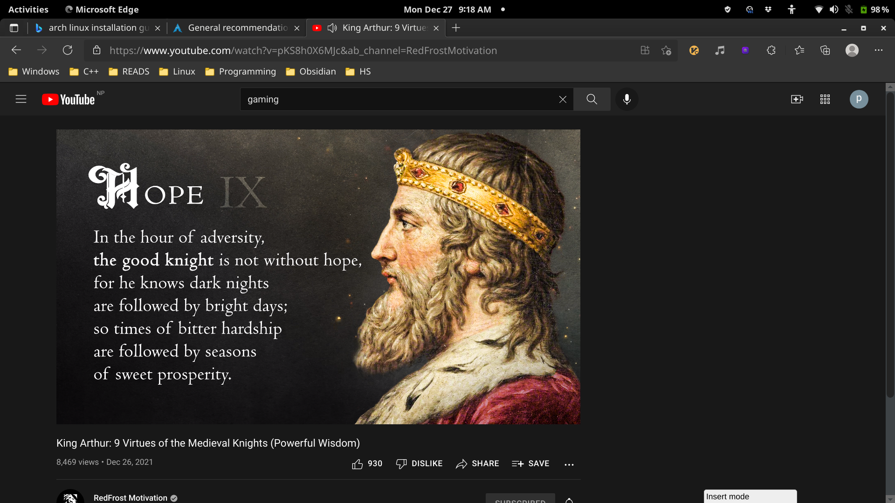

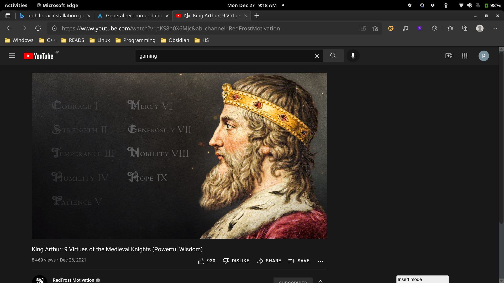
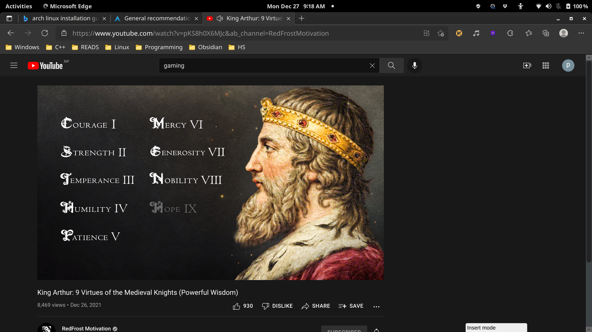

