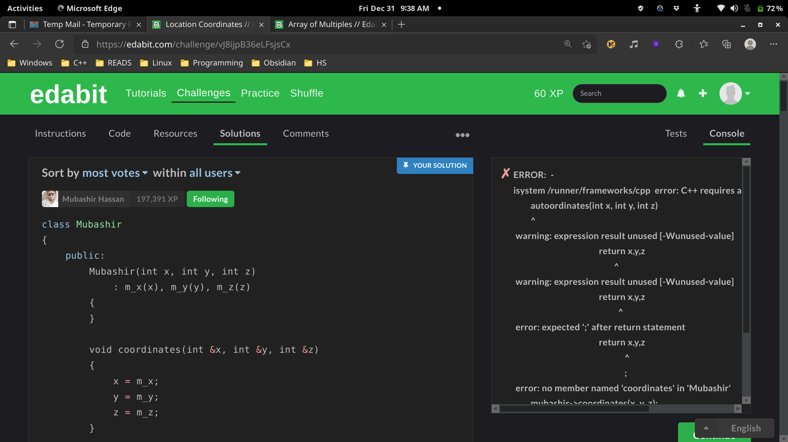

# 2021-12-31

## things to do 

- [ ] make your bed
- [x] brush your teeth morning
- [ ] meditate and visualization for 15mins

- [ ] study for 3 hrs with 48 mins break
- [ ] study for 3 hrs with 48 mins break
- [ ] study for 3 hrs with 48 mins break

- [ ] DO EDABIT 20 QUESTIONS

- [ ] use Anki for more than one hours 
- [ ] use vim for at least 30 mins 

- [x] brush your teeth in evening
- [ ] reflect
- [ ] Journalling
- [ ] make your table for another day to come 

## journal 
its new years eve and I am still coding ...
## Quotes of the day  

## read today 

## watched today 

## photo log

