# 2022-03-18

## things to do 

- [x] make your bed
- [x] brush your teeth morning
- [x] meditate and visualization for 15mins
- [ ] monkeytype for 15mins

- [ ] study for 3 hrs with 48 mins break
- [ ] study for 3 hrs with 48 mins break
- [ ] study for 3 hrs with 48 mins break

- [ ] use Anki for more than one hours 
- [ ] use vim for at least 30 mins 

- [ ] brush your teeth in evening
- [ ] reflect
- [ ] Journalling
- [ ] make your table for another day to come 

## journal 
starting after a long break,,,, I am well prepared now I am feeling well and good in all forms... I want to be better... better at programming better at life .... I am the best in what I do...
FOr past three weeks I went to a meditation center and I am feeling well now

## Quotes of the day  
Just dont stop
## read today 

## watched today 

## photo log

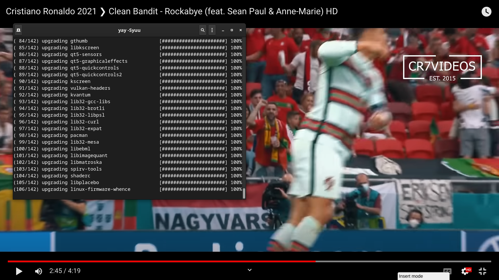
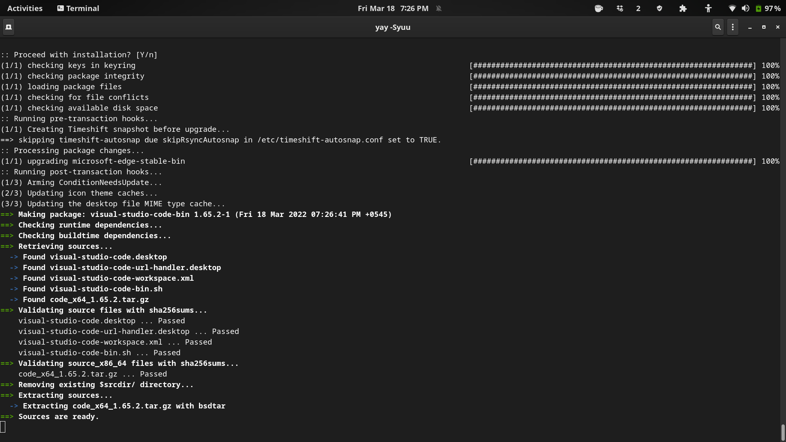
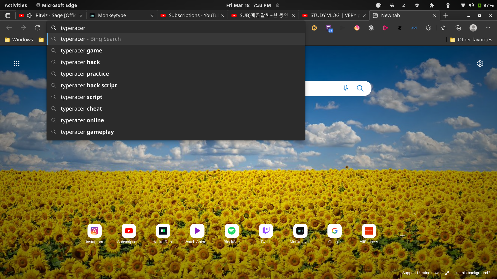
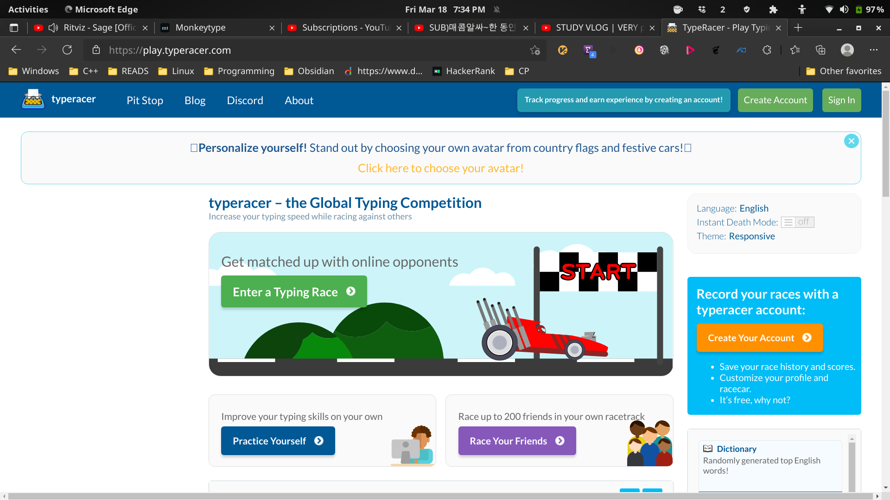
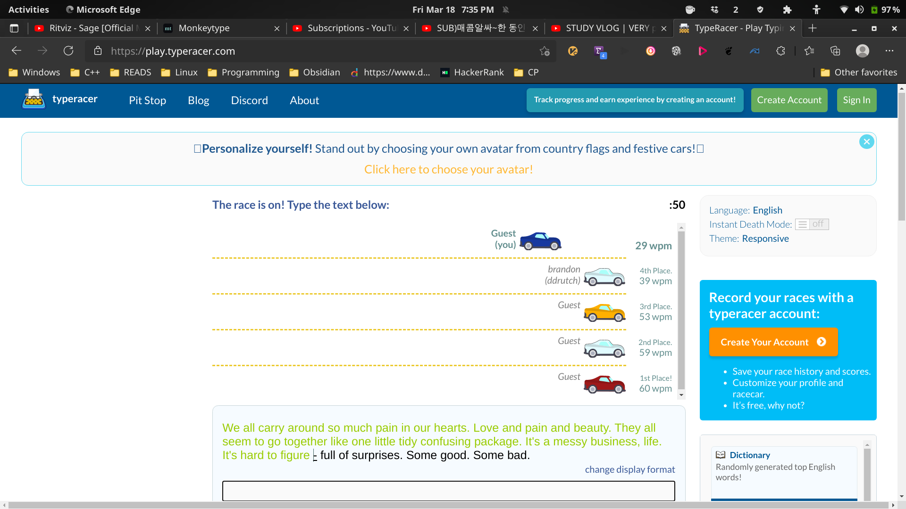
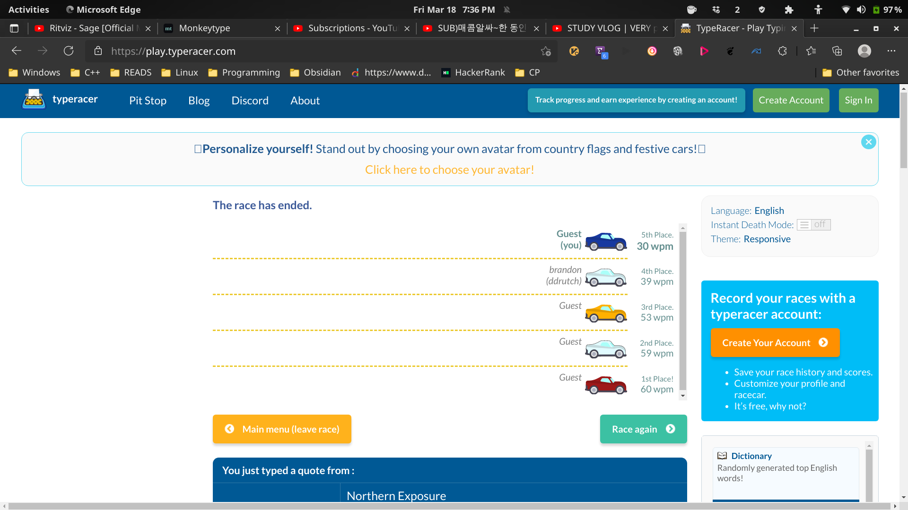
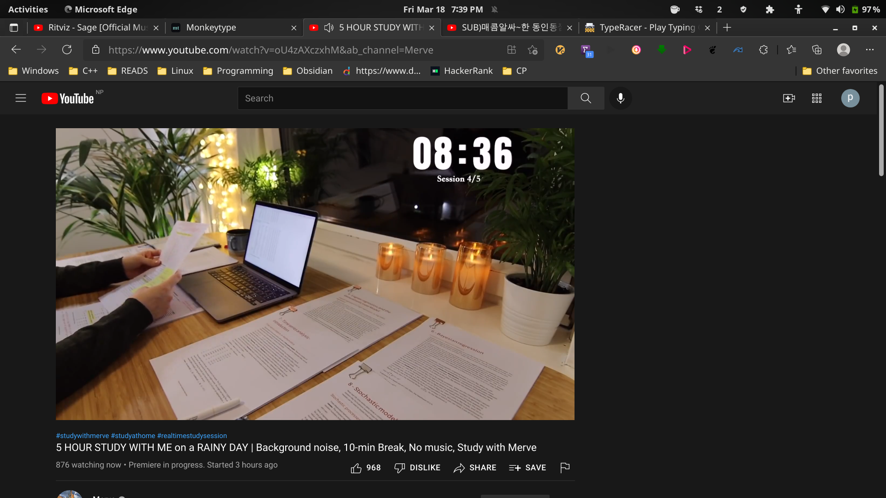
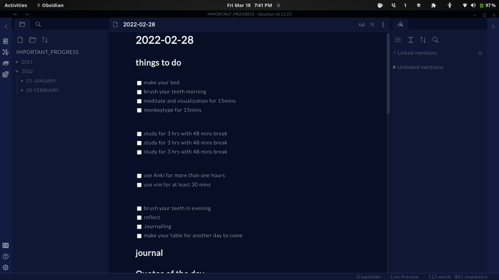
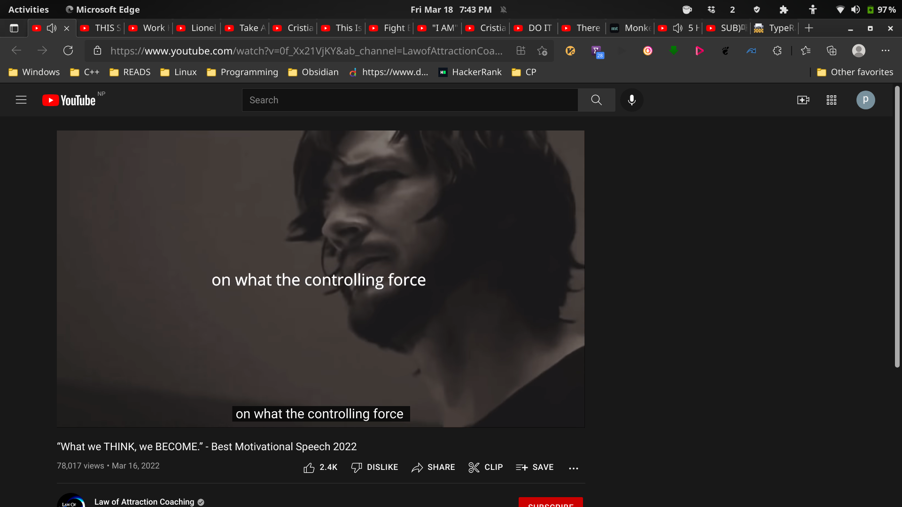
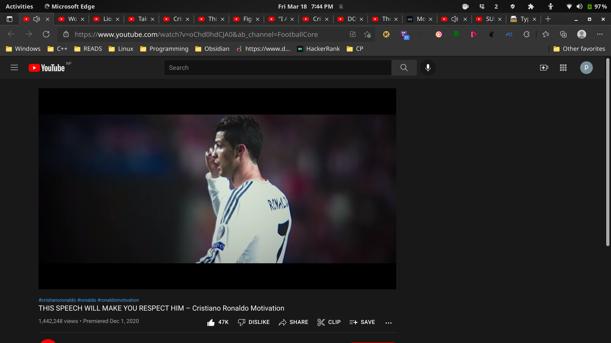
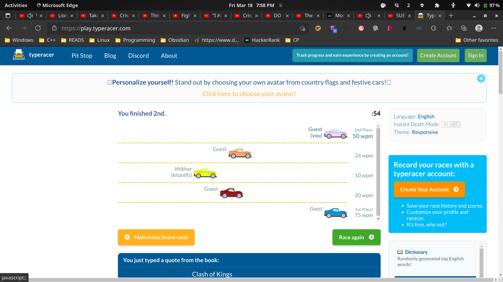
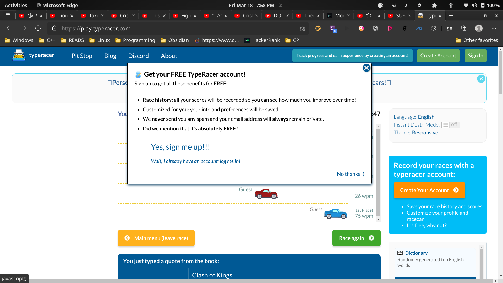

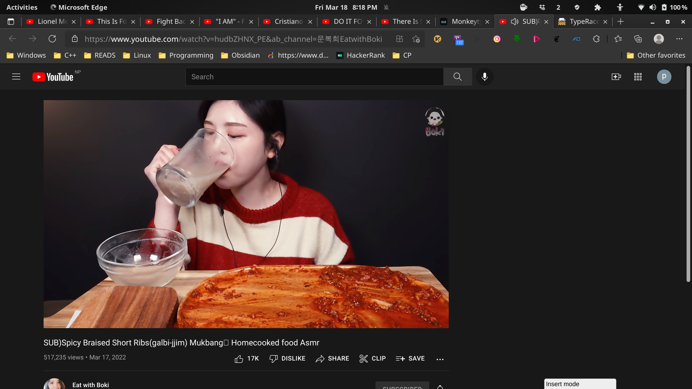